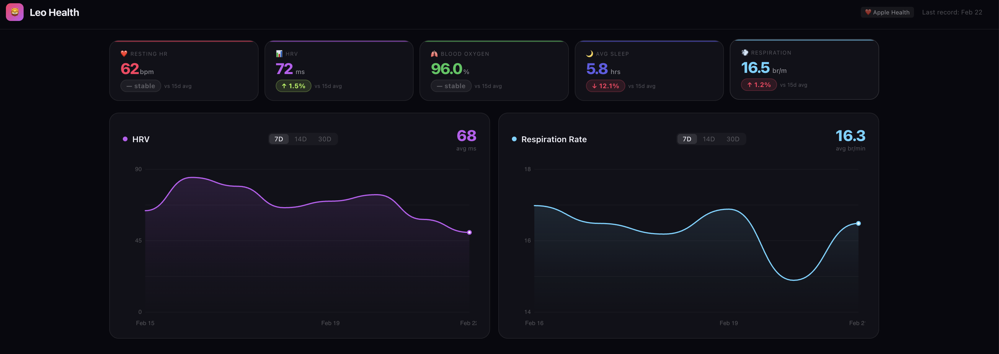
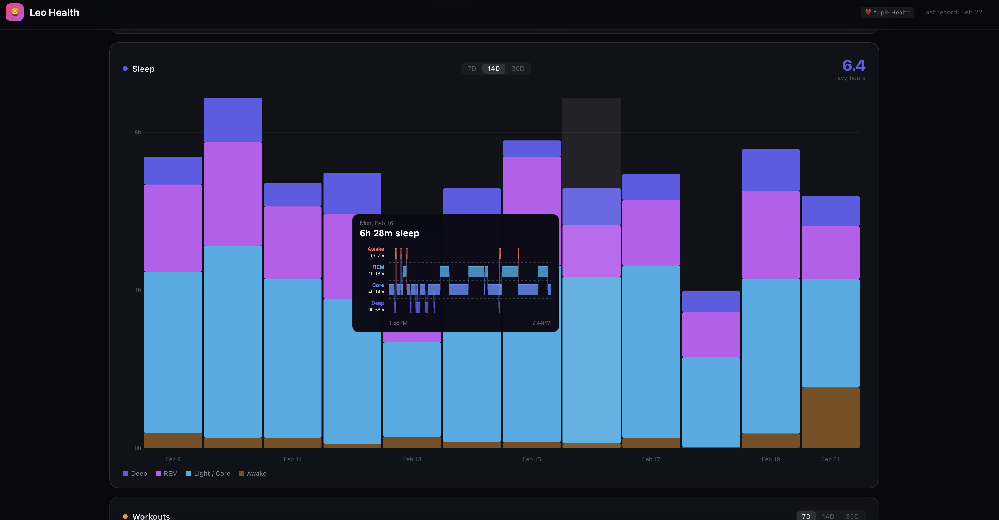

# Leo Health 🫀

> Your Apple Health and Whoop data — unified in a local SQLite database. In 60 seconds.

Apple Health locks your biometrics in a 4GB XML file. Whoop buries yours in CSVs with inconsistent column names. Leo Core parses both in under 60 seconds and writes everything to a single, normalized SQLite database — Heart Rate, Sleep, Workouts, HRV, Recovery Score, Blood Oxygen — all queryable with standard SQL.

**Zero network requests. Runs locally. MIT licensed.**


---

## 🧠 Leo Max — AI Health Coach (Coming Soon)

Local LLM that analyses your data privately. Bloodwork history, wearable trends, medical literature — all on your Mac, nothing leaves your machine.

**[Join the waitlist →](https://sandseb123.github.io/Leo-Health-Core)**
Founding members get lifetime preferred pricing.

---

## What it looks like





---

## Install
```bash
git clone https://github.com/sandseb123/Leo-Health-Core.git
cd Leo-Health-Core
pip3 install -e .
```

Three commands are now available anywhere on your Mac:
```bash
leo          # view your health dashboard
leo-watch    # start watching Downloads for new exports
leo-dash     # open full web dashboard in browser
```

> **Note:** If `pip3` is not found, try `pip install -e .` or install Python 3.9+ from [python.org](https://python.org)

---

## Docker

Run Leo Health in a container — works on macOS, Linux, and Windows.
```bash
# Clone the repo
git clone https://github.com/sandseb123/Leo-Health-Core.git
cd Leo-Health-Core

# Start the dashboard
docker compose up -d


# Open in browser
open http://localhost:5380
```

Drop your health exports into the `imports/` folder — Leo will detect and ingest them automatically.
```bash
# Import Apple Health export
cp ~/Downloads/export.zip imports/

# Import Whoop CSVs
cp ~/Downloads/whoop_recovery.csv imports/
```

**Or run directly without compose:**
```bash
docker run \
  -p 127.0.0.1:5380:5380 \
  -v ~/.leo-health:/home/leo/.leo-health \
  -e LEO_HOST=0.0.0.0 \
  leo-health
```

Data is stored in a Docker volume (`leo-data`) and persists across container restarts.
```bash
# Stop
docker compose down

# View logs
docker compose logs -f
```

---

## Get your data in

**Apple Health (iPhone):**
1. Open the Health app
2. Tap your profile picture → **Export All Health Data**
3. AirDrop it to your Mac — Leo detects and parses it automatically

**Whoop:** Open Whoop app → Profile → Export Data → check email for CSVs → AirDrop to Mac

```bash
leo-watch    # start the watcher — detects exports within 10 seconds
```

---

## Auto-Ingest via AirDrop ✨

Leo watches your Downloads folder and automatically parses any health export the moment it arrives — no commands needed after setup.

- Checks for new files every 10 seconds
- Uses ~8MB RAM, near-zero CPU while idle
- Never processes the same file twice
- Sends a macOS notification when ingestion completes

**Auto-start on login:** Coming soon.

---

## Query your data

```bash
sqlite3 ~/.leo-health/leo.db
```

```sql
-- Last 7 days of Whoop recovery
SELECT recorded_at, recovery_score, hrv_ms, resting_heart_rate
FROM whoop_recovery
ORDER BY recorded_at DESC LIMIT 7;

-- HRV by source (Apple Watch vs Whoop)
SELECT source, ROUND(AVG(value), 1) as avg_hrv, COUNT(*) as readings
FROM hrv GROUP BY source;

-- Sleep stage breakdown
SELECT stage, COUNT(*) as sessions
FROM sleep GROUP BY stage ORDER BY sessions DESC;

-- Top workouts by volume
SELECT activity, COUNT(*) as sessions, ROUND(AVG(calories), 0) as avg_cal
FROM workouts GROUP BY activity ORDER BY sessions DESC;
```

---

## What gets parsed

### Apple Health (`export.zip`)
| Data | Table | Metrics |
|------|-------|---------|
| Heart Rate | `heart_rate` | BPM, resting HR, walking avg |
| HRV | `hrv` | SDNN in milliseconds |
| Sleep | `sleep` | REM, Deep, Core, Awake stages |
| Workouts | `workouts` | Activity, duration, distance, calories |
| Blood Oxygen | `blood_oxygen` | SpO₂ % |

### Whoop (CSV exports)
| Data | Table | Metrics |
|------|-------|---------|
| Recovery | `whoop_recovery` | Score, HRV, resting HR, SpO2 |
| Strain | `whoop_strain` | Day strain, calories, max/avg HR |
| Sleep | `sleep` | Performance %, time in bed, stages |

---

## Privacy

Leo Core contains zero outbound network code. Verify the entire repository yourself:

```bash
grep -r "import urllib\|import http\|import requests\|import socket\|http.client\|urllib.request" .
```

You'll see three results, all in `leo_health/dashboard.py` — these are Python stdlib imports used to run a **local web server** on your own machine (localhost only). No data is sent anywhere. No outbound connections. No tracking.

Your data lives in `~/.leo-health/leo.db` and never leaves your machine.

**Threat model:** Dashboard binds to localhost only. Anyone with 
local machine access can read the DB. No authentication — 
designed for single-user desktop use only.

---

## Who this is for

**Leo Core** is an open-source developer tool. If you're comfortable with Terminal, `git clone` and `bash install.sh` gets you running in 2 minutes. Free forever, MIT licensed.

**Leo Max** is the upcoming AI health coach layer — a local LLM that runs against your unified health database, cross-references medical literature, and lets you upload bloodwork PDFs to track lab panels over time. Nothing leaves your Mac. [Join the waitlist →](https://sandseb123.github.io/Leo-Health-Core)

---

## Project structure

```
leo_health/
├── parsers/
│   ├── apple_health.py   # SAX streaming parser for export.zip
│   └── whoop.py          # Auto-detecting CSV parser
├── db/
│   ├── schema.py         # SQLite schema
│   └── ingest.py         # Unified ingest for all sources
└── dashboard.py          # Local web dashboard (localhost only)
status.py                 # leo command — terminal dashboard
watcher.py                # leo-watch — auto-ingest on AirDrop
install.sh                # One-command installer for macOS
pyproject.toml
```

---

## Roadmap

- [x] Apple Health XML parser
- [x] Whoop CSV parser
- [x] Normalized SQLite schema
- [x] `leo` terminal dashboard
- [x] `leo-watch` auto-ingest watcher
- [x] AirDrop → auto-parse workflow
- [ ] Oura Ring CSV support
- [ ] Linux support
- [ ] Fitbit CSV support
- [ ] Garmin `.fit` support
- [ ] Leo Max — AI Health Coach *(local LLM, fully private)*
- [ ] Leo Max — bloodwork PDF/photo ingestion
- [ ] Leo Max — macOS app *(no Terminal required)*

---

## Contributing

Good first issues:
- Add Oura Ring CSV parser
- Add Fitbit CSV parser
- Add Garmin `.fit` file support
- Add missing Whoop metrics to schema
- Improve test coverage

See [`good first issue`](../../issues?q=is%3Aissue+label%3A%22good+first+issue%22) labels to get started.

---

## License

**Leo Core** — MIT. Free to use, modify, and distribute.

**Leo Max** (AI Coach) is a separate commercial product — [join the waitlist](https://sandseb123.github.io/Leo-Health-Core).

---

<p align="center">Built by <a href="https://github.com/sandseb123">sandseb123</a></p>
